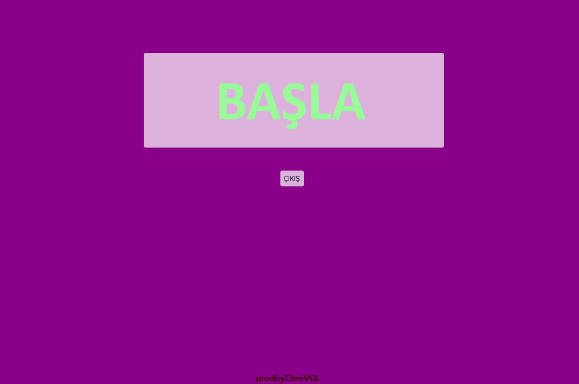
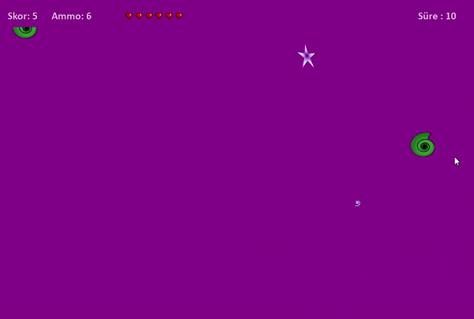

# Ustume Geliyorlar 2D Roguelike Oyunu - C# Windows App Uygulaması

## Herkese Selamlar

Bu proje, C#'a başladığım zaman yapmış olduğum ilk projelerden birisi. 
Bu projeyi yapmamdaki amaç; C# dilini öğrenmeye yeni başlamış birisi olarak, 'Windows App' uygulaması yaparken nelerle karşılaşabileceğimi kolay bir uygulama ile görmekti.

2D Roguelike oyunu mekaniğini basit düzeyde nasıl yapabileceğimi denemek istemem sonucu ortaya çıkan uygulama.

## İçindekiler

0. [Herkese Selamlar](#herkese-selamlar)
1. [Uygulama Hakkında](#uygulama-hakkında)
2. [Youtube Linki](#youtube-linki)

## Uygulama Hakkında

Oyun, uygulamanın **BAŞLAT** butonuna tıklandığı zaman başlar. W/A/S/D ile karakter hareket ettirilir ve space tuşu ile ateş edilir. Karakterin canı bittiği zaman oyun biter.

Oyun içi kısa bir görüntü:

## Youtube Linki

Youtube üzerinden paylaştığım uygulama videosuna [bu linkten](https://youtu.be/Ql9MDR1FqRI) ulaşabilirsiniz.
